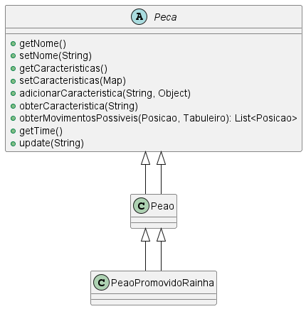

# Factory

### Intenção -

Fornecer uma interface para criação de objetos em uma superclasse porém as subclasses cotém permissão para alterar os tipos de objetos que serao criados.

### Motivação sem o Padrão -

Sem o uso do Factory a criação dos objetos seria feita diretamente no código do *Tabuleiro*. O acoplamento seria grande pois o *Tabuleiro* ia precisar conhecer detalhes da implementação de cada peça. Na criação de novas peças ou até na modificação da lógica de criação a classe Tabuleiro teria que ser modificada, violando o princípio **open/closed**.

```java
public class Tabuleiro {
    private Peca[][] pecas;

    public Tabuleiro() {
        pecas = new Peca[8][8];
        inicializarPecas();
    }

    private void inicializarPecas() {
        // Criando peças diretamente no Tabuleiro
        pecas[0][0] = new Peca("Rei", Time.BRANCO, new MovimentoRei(), null) {};
        pecas[0][1] = new Peca("Rainha", Time.BRANCO, new MovimentoRainha(), null) {};
        pecas[7][0] = new Peca("Rei", Time.PRETO, new MovimentoRei(), null) {};
        pecas[7][1] = new Peca("Rainha", Time.PRETO, new MovimentoRainha(), null) {};
    }
}
```

### UML sem Factory -



### Motivação no contexto do tabuleiro -

Com a aplicação do Factory, a lógica de criação das peças é encapsulada em subclasses de `PecaFactory`, permitindo que novas peças sejam adicionadas sem modificar o código do Tabuleiro. O método *criarPeca* permite a criação de peças com características personalizadas.

```java
package main.java.br.com.frameworkPpr.boardgame.padroes.criacionais.factory;

import java.util.Map;

import main.java.br.com.frameworkPpr.boardgame.game.Peca;
import main.java.br.com.frameworkPpr.boardgame.padroes.comportamentais.strategy.MovimentoStrategy;
import main.java.br.com.frameworkPpr.boardgame.padroes.criacionais.multiton.Time;

public abstract class PecaFactory {
    public abstract Peca criarPeca(String tipo, Time time, MovimentoStrategy movimentoStrategy, Map<String, Object> caracteristicas);

    public Peca criarPecaGenerica(String nome, Time time, MovimentoStrategy movimentoStrategy, Map<String, Object> caracteristicas) {
        return new Peca(nome, time, movimentoStrategy, caracteristicas) {
            @Override
            public void update(String evento) {
                // Implementação padrão, pode ser sobrescrita
                throw new UnsupportedOperationException("Unimplemented method 'update'");
            }
        };
    }
}
```

Exemplo de uma subclasse concreta:

```java
public class AnimalFactory extends PecaFactory {
    @Override
    public Peca criarPeca(String tipo, Time time, MovimentoStrategy movimentoStrategy, Map<String, Object> caracteristicas) {
        return switch (tipo) {
            case "Elefante" -> new Elefante(tipo, time, movimentoStrategy, caracteristicas);
            case "Leão" -> new Leao(tipo, time, movimentoStrategy, caracteristicas);
            // outros tipos...
            default -> throw new IllegalArgumentException("Tipo de peça desconhecido: " + tipo);
        };
    }
}
```

Uso correto no Tabuleiro:

```java
public class Tabuleiro {
    private Peca[][] pecas;
    private PecaFactory pecaFactory;

    public Tabuleiro(PecaFactory pecaFactory) {
        this.pecaFactory = pecaFactory;
        pecas = new Peca[8][8];
        inicializarPecas();
    }

    private void inicializarPecas() {
        pecas[0][0] = pecaFactory.criarPeca("Rei", Time.getInstance("Branco"), new MovimentoRei(), null);
        pecas[0][1] = pecaFactory.criarPeca("Rainha", Time.getInstance("Branco"), new MovimentoRainha(), null);
        pecas[7][0] = pecaFactory.criarPeca("Rei", Time.getInstance("Preto"), new MovimentoRei(), null);
        pecas[7][1] = pecaFactory.criarPeca("Rainha", Time.getInstance("Preto"), new MovimentoRainha(), null);
    }
}
```

### UML com Factory -


### Participantes -

1. **Produto:** Peca -> define a interface base para os objetos que serão criados;
2. **Factory:** PecaFactory -> contém o método responsável por criar as instâncias das peças.
3. **ConcreteFactory:** AnimalFactory (ou outra) -> implementa a lógica de criação específica.
4. **Client:** Tabuleiro -> classe que utiliza a fábrica para criar objetos.
