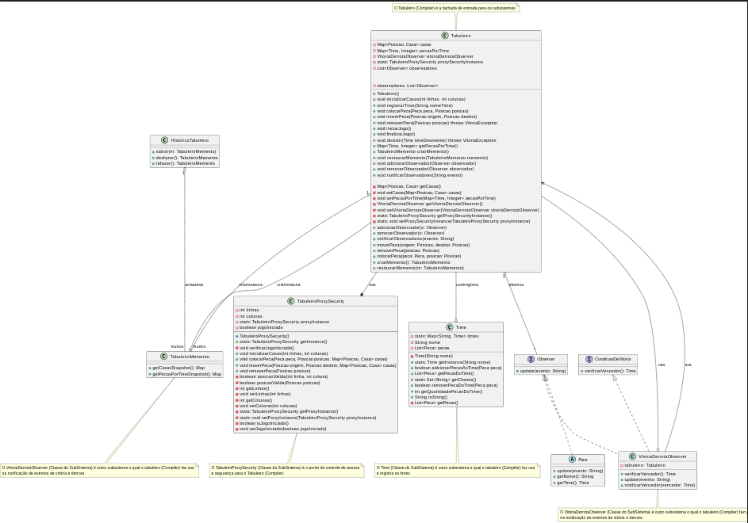

# Façade

## Intenção

[^GAMA]

- Fornecer uma interface unificada para um conjunto de interfaces em um subsistema.
- O Façade define uma interface de nível mais alto que torna o subsistema mais fácil de ser usado.

## Motivação

- Em um framework de tabuleiro, é necessário um ponto de entrada para acessar outras camadas e subsistemas, facilitando a implementação de regras de negócio.

### Sem o Façade

- As classes que utilizam o tabuleiro precisariam interagir diretamente com suas dependências internas, como `Casa`, `Posicao` e `Peca`. Além disso, as regras de negócio seriam densas, misturando validação, registro, gerenciamento de vitória e demais implementações em si mesmas.
  
- Isso resultaria em:
  - Alto acoplamento entre as classes.
  - Maior complexidade para os consumidores do subsistema.
  - Classe `Tabuleiro` densa, o que dificultaria manutenções.
  - Perda da flexibilidade do tabuleiro.

#### UML sem Façade

### Com o Façade

- A classe `Tabuleiro` atua como o Façade, fornecendo uma interface simplificada que gerencia o estado do tabuleiro, as regras de negócio, o posicionamento de casas e demais subsistemas do mesmo.
- Nesse sentido, além de conter sua própria lógica, a classe delega responsabilidades específicas, como validações, para outras classes (ex.: `TabuleiroProxySecurity`, `Time`, `VitoriaDerrotaObserver`, `TabuleiroMemento`), escondendo a complexidade do subsistema. Isso explicita a aplicação do princípio da responsabilidade única, uma vez que o tabuleiro delega responsabilidades a cada subsistema.

- A classe `Tabuleiro` fornece métodos de alto nível, como:
  - `colocarPeca`: Adiciona uma peça ao tabuleiro em uma posição válida.
  - `moverPeca`: Move uma peça de uma posição para outra, verificando as regras de negócio.
  - `removerPeca`: Remove uma peça do tabuleiro, atualizando o estado.
- Esses métodos encapsulam a lógica interna e delegam as atribuições (explicitadas na seção de Participantes).
- Isso resulta em:
  - Redução do acoplamento entre as classes.
  - Uso simplificado do subsistema.
  - Maior flexibilidade.

#### UML com o Façade

## Participantes

- **Façade (`Tabuleiro`)**
  - Conhece quais classes do subsistema são responsáveis pelo atendimento de solicitações.
- **Classes de Subsistema** (`TabuleiroProxySecurity`, `Time`, `VitoriaDerrotaObserver`, `TabuleiroMemento`)
  - Implementam a funcionalidade do subsistema.
  - Encarregam-se do trabalho atribuído pelo Façade:
    - **`TabuleiroProxySecurity`:** Realiza validações de segurança e controle de acesso.
    - **`Time`:** Gerencia os times e suas peças.
    - **`VitoriaDerrotaObserver`:** Observa eventos para determinar condições de vitória ou derrota.
    - **`TabuleiroMemento`:** Permite salvar e restaurar o estado do tabuleiro.
  - Não têm conhecimento do Façade; isto é, não mantêm referências para ele.

