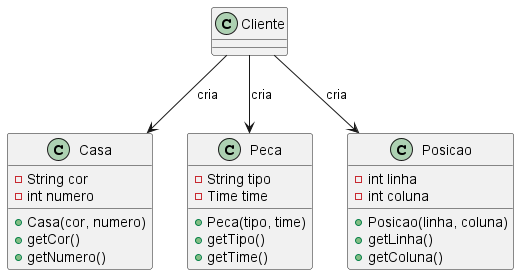
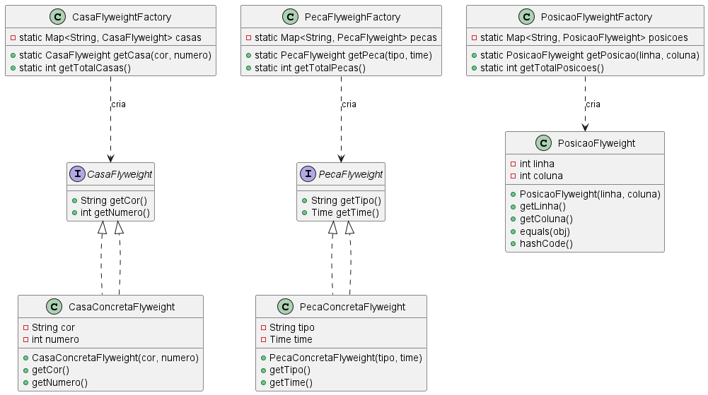

# Flyweight

### Intenção

O padrão Flyweight tem como objetivo compartilhar objetos para economizar memória, especialmente quando muitos objetos semelhantes são criados. Ele separa o estado compartilhado (intrínseco) do estado específico de cada instância (extrínseco).

### Motivação sem o Padrão

Sem o uso do Flyweight, cada casa, peça ou posição do tabuleiro seria representada por um novo objeto, mesmo que compartilhassem os mesmos atributos (ex: cor, tipo, posição). Isso resultaria em alto consumo de memória e redundância de dados.

### UML sem Flyweight

### Motivação no contexto do tabuleiro

No contexto do tabuleiro, existem muitas casas, peças e posições que podem ser reutilizadas. O padrão Flyweight permite que objetos com o mesmo estado sejam compartilhados, otimizando o uso de memória e melhorando a performance do sistema.

### UML com Flyweight

### Participantes

- **Flyweight (CasaFlyweight, PecaFlyweight):** Interface para os objetos compartilhados.
- **ConcreteFlyweight (CasaConcretaFlyweight, PecaConcretaFlyweight, PosicaoFlyweight):** Implementação do Flyweight, armazena o estado intrínseco.
- **FlyweightFactory (CasaFlyweightFactory, PecaFlyweighFactory, PosicaoFlyweightFactory):** Garante o compartilhamento dos objetos.
- **Cliente:** Solicita objetos às fábricas e utiliza os Flyweights.

---
