# Framework para construção de tabuleiros
# Equipe 5 - Jabes Cajazeiras, Luis Guilherme, Náthaly Brito

## Padrões Comportamentais

### Command 

#### Intenção
encapsular uma requisão como um objeto, assim pode-se parametrizar clientes com diferentes requisições, enfileirar ou registrar requisições e suportar operações de desfazer/refazer.

#### Motivação sem o Padrão
Sem o uso do padrão, o código do cliente ficaria responsável por saber como executar cada ação, como mover a peça. Isso geraria alto acoplamento pois o cliente teria que conhecer detalhes do tabuleiro e das peças. Haveria dificuldade em desfazer e refazer pois não teria um mecanismo simples para registrar e reverter ações.

##### Exemplo sem o command:
``` java
// Cliente faz tudo manualmente
tabuleiro.moverPeca(origem, destino);
// Para desfazer, teria que saber como reverter:
tabuleiro.moverPeca(destino, origem);
```
##### UML sem o Command

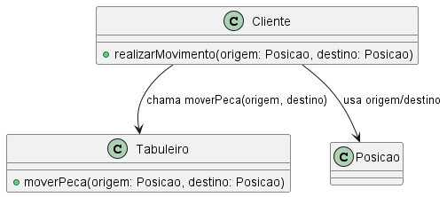

#### Motivação com o Padrão
No nosso projeto o Command é aplicadado na manipulação de ações do tabuleiro, como mover peças. Assim o código que solicita a ação não precisa saber vomo ela é executada. A interface Command define os métodos que são implementados pela classe MevePieceCommand.

##### Definição da regra para comandos:
``` java
package main.java.br.com.frameworkPpr.boardgame.padroes.comportamentais.command;

public interface Command {
    void execute();
    void undo();
}
```

##### Encapsulamento da ação de mover uma peça no tabuleiro:
``` java
package main.java.br.com.frameworkPpr.boardgame.padroes.comportamentais.command;

import main.java.br.com.frameworkPpr.boardgame.game.Posicao;
import main.java.br.com.frameworkPpr.boardgame.game.Tabuleiro;

public class MovePieceCommand implements Command {
    private Tabuleiro tabuleiro;
    private Posicao origem;
    private Posicao destino;

    public MovePieceCommand(Tabuleiro tabuleiro, Posicao origem, Posicao destino) {
        this.tabuleiro = tabuleiro;
        this.origem = origem;
        this.destino = destino;
    }

    @Override
    public void execute() {
        tabuleiro.moverPeca(origem, destino);
    }

    @Override
    public void undo() {
        tabuleiro.moverPeca(destino, origem);
    }
}
```

O *Tabuleiro* executa a lógica real de movimentação:
``` java 
   public void moverPeca(Posicao origem, Posicao destino) {
        getProxySecurityInstance().moverPeca(origem, destino, getCasas());
        Casa casaDestino = getCasas().get(destino);
        Casa casaOrigem = getCasas().get(origem);
        Peca pecaMovida = casaOrigem.getPeca();
        casaDestino.setPeca(pecaMovida);
        casaOrigem.setPeca(null);
        notificarObservadores("peça movida: " + origem.getLinha() + "," + origem.getColuna() + " para " + destino.getLinha() + "," + destino.getColuna());
    }
```

##### UML com o Command 

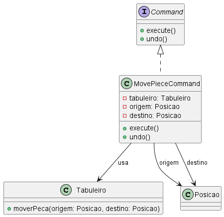

#### Participantes:
1. Command (interface Command):
   - declara uma interface para a execução de uma operação.   
2. ConcreteCommand (classe MovePieceCommand)
   - define uma vinculação entre um objeto Receiver e uma ação;
   - implementa  Execute() e undo()  através  da  invocação  da(s)  correspondente(s)
operação(ões) no Receiver.
3. Receiver (classe Tabuleiro):
   - cria um objeto ConcreteCommand e estabelece o seu receptor.
4. Invoker: 
5. Client (Tauleiro Selva): 
    - sabe como executar as operações associadas a uma solicitação. Qualquer
classe pode funcionar como um Receiver.


### Memento

#### Intenção

sem violar o encapsulamento, captura e externaliza o estado interno de um objeto, assim, depois ele pode ser restaurado para esse estado.

#### Motivação sem o Memento

Sem o uso do padrão, para implementar ações de desfazer ou refazer seria necessário manipular diretamente o estado interno do *Tabuleiro* levando a quebra do encapsulamento já que outras classes precisariam acessar e modiicar os atributos internos de *Tabuleiro*.

##### Exemplo de como ficaria a manipulação direta

``` java
//lista para armazenar snapshots manuais do estado
List<Map<Posicao, Casa>> historicoCasas = new ArrayList<>();

// Antes de cada jogada, salva manualmente o estado atual
historicoCasas.add(new HashMap<>(tabuleiro.getCasas()));

// Para desfazer, restaura o último estado salvo manualmente
if (!historicoCasas.isEmpty()) {
    Map<Posicao, Casa> estadoAnterior = historicoCasas.remove(historicoCasas.size() - 1);
    tabuleiro.getCasas().clear();
    tabuleiro.getCasas().putAll(estadoAnterior);
}
```

##### UML sem o Memento

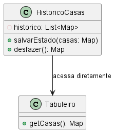

#### Motivação com o Memento

Com a aplicação do Memento, o estado do *Tabuleiro* antes de cada jogada é salvo, dessa maneira, o jogador poderá desfazer ou refazer uma jogada. Ele poderá fazer isso facilmente pois outras partes do código não precisarão conhecer a estrutura interna do tabuleiro.

##### A classe *TabuleiroMemento* armazena snapshots do estado do tabuleiro

``` java
public class TabuleiroMemento {
    private final Map<Posicao, Casa> casasSnapshot;
    private final Map<Time, Integer> pecasPorTimeSnapshot;

    public TabuleiroMemento(Map<Posicao, Casa> casas, Map<Time, Integer> pecasPorTime) {
        this.casasSnapshot = casas;
        this.pecasPorTimeSnapshot = pecasPorTime;
    }

    public Map<Posicao, Casa> getCasasSnapshot() {
        return casasSnapshot;
    }

    public Map<Time, Integer> getPecasPorTimeSnapshot() {
        return pecasPorTimeSnapshot;
    }
}
```

##### Tabuleiro cria e restaura mementos

``` java
    public TabuleiroMemento criarMemento()
    {
        return new TabuleiroMemento(new HashMap<>(casas), new HashMap<>(pecasPorTime));
    }

    public void restaurarMemento(TabuleiroMemento memento)
    {
        setCasas(new HashMap<>(memento.getCasasSnapshot()));
        setPecasPorTime(new HashMap<>(memento.getPecasPorTimeSnapshot()));
    }
```

##### O *HistoricoTabuleiro* armazena e gerencia os mementos

``` java
package main.java.br.com.frameworkPpr.boardgame.padroes.comportamentais.memento;

import java.util.Stack;

public class HistoricoTabuleiro {
    private final Stack<TabuleiroMemento> desfazer = new Stack<>();
    private final Stack<TabuleiroMemento> refazer = new Stack<>();

    public void salvar(TabuleiroMemento memento) {
        desfazer.push(memento);
        refazer.clear();
    }

    public TabuleiroMemento desfazer()
    {
        if (!desfazer.isEmpty()) {
            TabuleiroMemento memento = desfazer.pop();
            refazer.push(memento);
            return memento;
        }
        return null;
    }
    
    public TabuleiroMemento refazer()
    {
        if (!refazer.isEmpty()) {
            TabuleiroMemento memento = refazer.pop();
            desfazer.push(memento);
            return memento;
        }
        return null;
    }

    public boolean temDesfazer()
    {
        return !desfazer.isEmpty();
    }

    public boolean temRefazer()
    {
        return !refazer.isEmpty();
    }
}
```

##### UML com memento

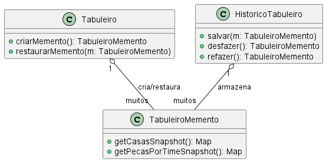>

#### Participantes

1. Memento: TabuleiroMemento -> armazena o estaod interno do *Tabueleiro* para que possa ser posteriormente restaurado;
2. Originator: Tabuleiro -> cria um *TabueliroMemento* com seu estado atual e pode restaurar seu estado a partir de um memento.
3. Caretaker: HistoricoTabuleiro -> gerencia os mementos criados pelo Tabuleiro para desfazer/refazer;


### Observer

#### Intenção -

Define uma dependência um-para-muitos entre objetos, para que quando um objeto mudar seu estado todos os seus **dependentes** são notificados e atualizados automaticamente. Isso promove o princípio **aberto/fechado (open/closed)**, já que permite adicionar novos observadores sem modificar o sujeito.

#### Motivação sem o Observer -

Sem o uso do Observer a implementação do monitoramento e observação teria que ser direto no *Tabuleiro*, assim, ele precisaria conhecer todas as classes que dependem de mudanças no estado do jogo, como a de VitoriaDerrotaObserver e Peca. Adicionar novas classes que precisariam ser notificadas resultaria na modificação da classe *Tabuleiro* violando o princípio **open/closed**. , o Tabuleiro teria que conhecer e manipular diretamente todas as peças e suas reações a eventos

```java
package br.com.frameworkPpr.xadrez.board;

import br.com.frameworkPpr.xadrez.pieces.Peca;

public class Tabuleiro {
    private Peca[][] pecas;
    private int pecasBrancas;
    private int pecasPretas;

    public Tabuleiro() {
        pecas = new Peca[8][8];
        pecasBrancas = 16;
        pecasPretas = 16;
    }

    public void removerPeca(int x, int y) {
        Peca peca = pecas[x][y];
        if (peca != null) {
            if (peca.getTime().equals("Branco")) {
                pecasBrancas--;
            } else if (peca.getTime().equals("Preto")) {
                pecasPretas--;
            }
            pecas[x][y] = null;

            // verificação de vitória diretamente no Tabuleiro
            if (pecasBrancas == 0) {
                System.out.println("Time Preto venceu!");
            } else if (pecasPretas == 0) {
                System.out.println("Time Branco venceu!");
            }
        }
    }
}
```

##### UML sem o Observer -

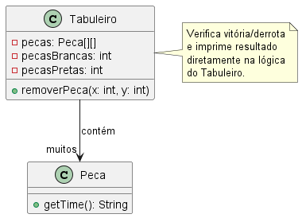>


#### Motivação no contexto do Tabuleiro -

Com o uso do Observer, o *Tabuleiro* notifica automaticamente os observadores (*vitoriaDerrotaObserver*, *Peca*) sobre eventos importantes. As peças implementam a interface Observer, assim elas são registradas como observadores do *Tabuleiro*. Quando uma ação acontece, o *Tabuleiro* chama o método **notificarObservadores(evento)** que percorre todos os observadores e chama o **update(evento)**.

##### Tabuleiro mantém e notifica os Observers

``` java
   private List<Observer> observadores = new ArrayList<>();

   public void adicionarObservador(Observer observador)
    {
        observadores.add(observador);
    }

    public void removerObservador(Observer observador)
    {
        observadores.remove(observador);
    }

    public void notificarObservadores(String evento)
    {
        for (Observer observador : observadores)
        {
            observador.update(evento);
        }
    }
```
##### Peças implementam o Observer
``` java
    @Override
    public void update(String evento) {
        System.out.println("Peça" + getNome() + " recebeu notificação: " + evento);

        if (evento.startsWith("peça movida")) {
            String[] partes = evento.split(":");
            String[] posicoes = partes[1].trim().split(" para ");
            Posicao origem = new Posicao(Integer.parseInt(posicoes[0].split(",")[0]), Integer.parseInt(posicoes[0].split(",")[1]));
            Posicao destino = new Posicao(Integer.parseInt(posicoes[1].split(",")[0]), Integer.parseInt(posicoes[1].split(",")[1]));

            System.out.println("Movimento detectado de " + origem + " para " + destino);
        }
    }
```

##### Tabuleiro notifica as Peças e outros Observers

``` java
    public void moverPeca(Posicao origem, Posicao destino) {
        getProxySecurityInstance().moverPeca(origem, destino, getCasas());
        Casa casaDestino = getCasas().get(destino);
        Casa casaOrigem = getCasas().get(origem);
        Peca pecaMovida = casaOrigem.getPeca();
        casaDestino.setPeca(pecaMovida);
        casaOrigem.setPeca(null);
        notificarObservadores("peça movida: " + origem.getLinha() + "," + origem.getColuna() + " para " + destino.getLinha() + "," + destino.getColuna());
    }
```

##### *VitoriaDerrotaObserver* implementa a interface Observer e é registrado como observador de *Tabuleiro*.
``` java
package main.java.br.com.frameworkPpr.boardgame.padroes.comportamentais.observer;

public interface Observer {
    void update(String evento);
}
```

``` java
public class VitoriaDerrotaObserver implements Observer, CondicaoDeVitoria{
}
```

##### O *VitoriaDerrotaObserver* é acionado à lista de observadores do *Tabuleiro*

##### UML com o Observer -

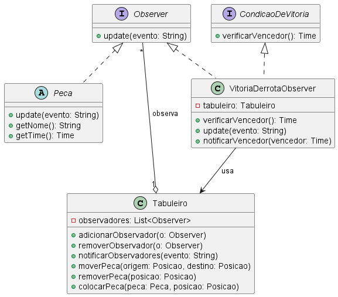>

#### Participantes -

1. **Subject:** Tabuleiro -> ele é o objeto observado, mantém uma lista de observadores e notifica-os sobre mudanças no estado do jogo;
2. **Observer:** interface Observer -> ela define o as regras para objetos que desejam ser notificados sobre as mudanças.
3. **ConcreteObserver:** VitoriaDerrotaObserver, Peca -> implementa a interface Observer e reage as notificações do *Tabuleiro*.


### State

#### Intenção

Permitir que um objeto altere seu comportamento quando seu estado interno muda. Ele encapsula os possíveis estados de um objeto em *classes separadas* promovendo a separação de responsabilidades.

#### Motivação sem o State

Sem a aplicação do pasrão o comportamento do objeto setia controlado por grandes estruturas de if-else ou switch-case que verificariam o estado atual pra decidir o que fazer. Toda lógica de estados estaria concentrada em apenas uma classe dificultando

##### Exemplo de código sem o padrão State

```java
// Exemplo sem o padrão State
public class Jogo {
    private String estado = "INICIADO";

    public void iniciarJogo() {
        if ("INICIADO".equals(estado)) {
            System.out.println("O jogo já está iniciado.");
        } else if ("PAUSADO".equals(estado)) {
            estado = "INICIADO";
            System.out.println("Jogo retomado.");
        } else if ("FINALIZADO".equals(estado)) {
            System.out.println("Não é possível iniciar, o jogo já foi finalizado.");
        }
    }

    public void pausarJogo() {
        if ("INICIADO".equals(estado)) {
            estado = "PAUSADO";
            System.out.println("Jogo pausado.");
        } else {
            System.out.println("Não é possível pausar neste estado: " + estado);
        }
    }

    public void finalizarJogo() {
        if (!"FINALIZADO".equals(estado)) {
            estado = "FINALIZADO";
            System.out.println("Jogo finalizado.");
        } else {
            System.out.println("O jogo já está finalizado.");
        }
    }
}
```

##### UML sem o padrão

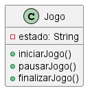


#### Motivação com o State

O padrão State é utilizado no projeto para controlar o comportamento do jogo conforme o seu estado atual (iniciado, pausado, finalizado, etc.), evitando o uso de grandes estruturas condicionais e promovendo a separação de responsabilidades.

##### Implementação no framework

Objeto principal que representa o contexto do jogo é a classe ContextoJogo

```java
package main.java.br.com.frameworkPpr.boardgame.padroes.comportamentais.State;

public class ContextoJogo {
    private EstadoJogo estadoAtual;

    public ContextoJogo() {
        this.estadoAtual = new EstadoIniciado(this);
    }

    public void setEstadoAtual(EstadoJogo novoEstado)
    {
        this.estadoAtual = novoEstado;
    }

    public void iniciarJogo() {
        estadoAtual.iniciarJogo();
    }

    public void pausarJogo() {
        estadoAtual.pausarJogo();
    }

    public void reiniciarJogo(){
        estadoAtual.reiniciarJogo();
    }

    public void finalizarJogo() {
        estadoAtual.finalizarJogo();
    }

    public EstadoJogo getEstadoAtual() {
        return estadoAtual;
    }
}

```

O estado atual do jogo é representado pela interface EstadoJogo e suas implementações concretas EstadoIniciado, EstadoPausado e EstadoFinalizado.

```java
package main.java.br.com.frameworkPpr.boardgame.padroes.comportamentais.State;

import main.java.br.com.frameworkPpr.boardgame.game.Tabuleiro;

public interface EstadoJogo {
    void iniciarJogo();
    void pausarJogo();
    void finalizarJogo();
    void reiniciarJogo();
}

```

##### UML com o padrão

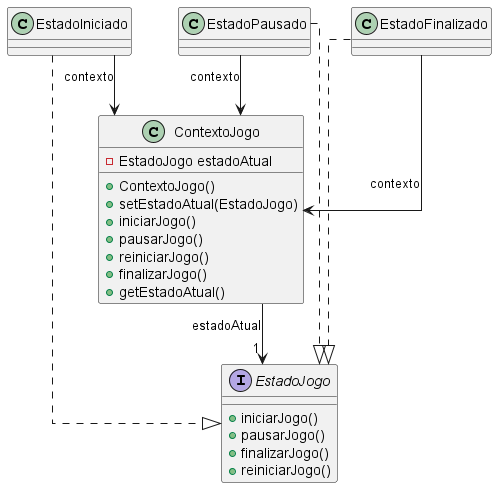

#### Participantes

1. **State:** EstadoJogo -> Interface que define as operações para os diferentes estados do jogo.
2. **ConcreteState:** Estados concretos -> Implementações concretas da interface EstadoJogo, cada uma representando um estado do jogo.
3. **Context:** ContextoJogo -> Classe que mantém uma referência para o estado atual e delega as operações para o estado corrente.
4. **Client:** Tabuleiro/TabuleiroProxySecurity -> Classes que utilizam o ContextoJogo para controlar o fluxo do jogo, delegando as operações de estado.

### Strategy

#### Intenção -

Definir uma família de algoritmos em classes separadas para que seus objetos sejam intercambiáveis.

#### Motivação sem o Padrão -

Sem o uso do Strategy a implementação de movimento de peças teria que ser diretamente na classe *Peça*. Isso reduz a flexibilidade já que toda lógica de movimento de diferentes peças estaria centralizada em uma única classe, assim, não seria possível reutiliar a lógica em outro contexto sem a duplicação do código. Para adicionar novas peças ou até mesmo alterar a lógica do movimento, teriamos que modificar a classe *Peça* violando o princípio **Open/Closed** - aberto para extensão e fechado para modificação.

``` java
package br.com.frameworkPpr.xadrez.pecas;

import java.util.ArrayList;
import java.util.List;

public class Peca {
    private String tipo;

    public Peca(String tipo) {
        this.tipo = tipo;
    }

    public List<String> calcularMovimentosPossiveis() {
        List<String> movimentos = new ArrayList<>();

        switch (tipo) {
            case "Rei":
                // Lógica de movimento do Rei
                movimentos.add("Movimento do Rei");
                break;
            case "Rainha":
                movimentos.add("Movimento da Rainha");
                break;
            case "Bispo":
                movimentos.add("Movimento do Bispo");
                break;
            default:
                throw new IllegalArgumentException("Tipo de peça desconhecido: " + tipo);
        }
        return movimentos;
    }
}
```

##### UML sem o Strategy -

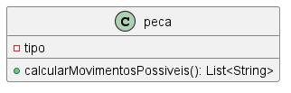


#### Motivação no contexto do Tabuleiro

Aqui, o strategy é usado para definir diferentes estratégias de movimento para as peças. Cada peça pode ter sua própria lógica de movimento. A interface *MovimentoStrategy* define o método *calcularMovimentosPossiveis* que é implementado por classes específicas para cada tipo de peça.

``` java
package main.java.br.com.frameworkPpr.boardgame.padroes.comportamentais.strategy;

import java.util.List;

import main.java.br.com.frameworkPpr.boardgame.game.Posicao;
import main.java.br.com.frameworkPpr.boardgame.game.Tabuleiro;

public interface MovimentoStrategy {
    List<Posicao> calcularMovimentosPossiveis(Posicao posicaoAtual, Tabuleiro tabuleiro);
}
```

exemplo de aplicação para uma peça:

``` java
package main.java.br.com.frameworkPpr.xadrez.movement;

import main.java.br.com.frameworkPpr.xadrez.board.Posicao;
import main.java.br.com.frameworkPpr.xadrez.board.tabuleiro.singletonEProxySecurity.Tabuleiro;
import java.util.ArrayList;
import java.util.List;

public class MovimentoRei implements MovimentoStrategy {
    @Override
    public List<Posicao> calcularMovimentosPossiveis(Posicao posicaoAtual, Tabuleiro tabuleiro) {
        List<Posicao> movimentos = new ArrayList<>();
        return movimentos;
    }
}
```

##### UML com Strategy -

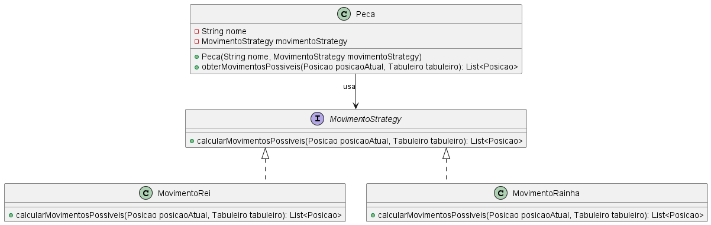

#### Participantes -

1. **Strategy:** MovimentoStrategy -> declara o método calcularMovimentosPossiveis que é implementado por diferentes estratégias;
2. **ConcretStrategy:** serão os métodos que implementam a interace MovimentoStrategy que criarão a lógica específica de cada peça;
3. **Context:** Peca -> contém a referência para um objeto MovimentoStrategy, delega a execução do método *calcularMovimentosPossiveis* para a estratégia associada (ConcretStrategy).

## Padrões Criacionais

### Builder

#### Intenção
Separa a construção de um objeto complexo da sua representação, assim o mesmo processo de construção pode criar diferentes representações.

#### Motivação sem o Padrão
Sem o uso do Builder, a construção de um tabuleiro ficaria centralizada em uma única classe, no caso *Tabuleiro*. Isso traria problemas como dificuladades de reutilizar partes da construção e violação do princípio de responsabilidade única, pois o *Tabuleiro* teria que saber tanto como construir quanto como se comportar dificultando a manutenção.

##### Exemplo de implementação sem o Builder:
``` java
package br.com.frameworkPpr.boardgame.game;

public class Tabuleiro {
    private int largura;
    private int altura;
    private String[][] casas;
    private String[][] pecas;

    public Tabuleiro(int largura, int altura, boolean xadrez) {
        this.largura = largura;
        this.altura = altura;
        this.casas = new String[largura][altura];
        this.pecas = new String[largura][altura];
        criarCasas();
        if (xadrez) {
            posicionarPecasXadrez();
        }
    }

    private void criarCasas() {
        for (int i = 0; i < largura; i++) {
            for (int j = 0; j < altura; j++) {
                casas[i][j] = ((i + j) % 2 == 0) ? "branca" : "preta";
            }
        }
    }

    private void posicionarPecasXadrez() {
        // Lógica fixa para posicionar peças de xadrez
        pecas[0][0] = "torre preta";
        pecas[0][1] = "cavalo preto";
        pecas[7][7] = "torre branca";
    }
}
```

##### UML sem builder

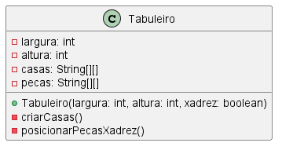

#### Motivação com o Padrão
no projeto, o Builder é usado para permitir a construção flexível de diferentes tipos de tabuleiros, separando o processo de construção da representação final do objeto. Isso facilita a criação de tabuleiros personalizados para diferentes jogos.

##### A interface *TabuleiroBuilder* define os métodos necessários para construir um tabuleiro:
``` java
package main.java.br.com.frameworkPpr.boardgame.padroes.criacionais.builder;

import main.java.br.com.frameworkPpr.boardgame.game.Tabuleiro;

public interface TabuleiroBuilder {
    void iniciarTabuleiro(int largura, int altura);
    void adicionarPecas();
    void adicionarCasas();
    Tabuleiro getResultado();
}
```
##### O *TabuleiroDirector* orquestra a construção do tabuleiro. Ele chama os métodos do builder na ordem correta para criar o tabuleiro:
``` java
package main.java.br.com.frameworkPpr.boardgame.padroes.criacionais.builder;

import main.java.br.com.frameworkPpr.boardgame.game.Tabuleiro;

public class TabuleiroDirector {
    private final TabuleiroBuilder builder;

    public TabuleiroDirector(TabuleiroBuilder builder) {
        this.builder = builder;
    }

    public Tabuleiro construir(int largura, int altura) {
        builder.iniciarTabuleiro(largura, altura);
        builder.adicionarCasas();
        builder.adicionarPecas();
        return builder.getResultado();
    }
}
```

##### UML com Builder:

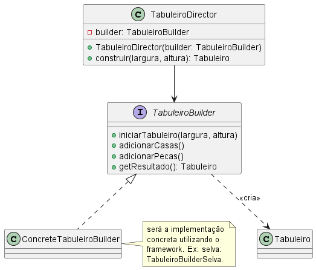

#### Participantes:

1. Builder (TabuleiroBuilder) 
    - especifica  uma  interface  abstrata  para  criação  de  partes  de  um  objeto-
produto. Nesse caso, os contratos:  iniciarTabuleiro(int largura, int altura); adicionarPecas(); e void adicionarCasas();

2. ConcreteBuilder (Tabuleiro Buider Selva)
   - constrói e monta partes do produto pela implementação da interface de TabuleiroBuilder;
   - define e mantém a representação que cria;
   - È a implementação concreta do framework


3. Director (TabuleiroDirector)
   - constrói um objeto usando a interface de Builder.
  
3.  Product ().
    - representa o objeto complexo em construção. ConcreteBuilder constrói a
representação  interna  do  produto  e  define  o  processo  pelo  qual  ele  é
montado;
    - inclui classes que definem as partes constituintes, inclusive as interfaces
para a montagem das partes no resultado final.


### Factory

#### Intenção -

Fornecer uma interface para criação de objetos em uma superclasse porém as subclasses cotém permissão para alterar os tipos de objetos que serao criados.

#### Motivação sem o Padrão -

Sem o uso do Factory a criação dos objetos seria feita diretamente no código do *Tabuleiro*. O acoplamento seria grande pois o *Tabuleiro* ia precisar conhecer detalhes da implementação de cada peça. Na criação de novas peças ou até na modificação da lógica de criação a classe Tabuleiro teria que ser modificada, violando o princípio **open/closed**.

```java
public class Tabuleiro {
    private Peca[][] pecas;

    public Tabuleiro() {
        pecas = new Peca[8][8];
        inicializarPecas();
    }

    private void inicializarPecas() {
        // Criando peças diretamente no Tabuleiro
        pecas[0][0] = new Peca("Rei", Time.BRANCO, new MovimentoRei(), null) {};
        pecas[0][1] = new Peca("Rainha", Time.BRANCO, new MovimentoRainha(), null) {};
        pecas[7][0] = new Peca("Rei", Time.PRETO, new MovimentoRei(), null) {};
        pecas[7][1] = new Peca("Rainha", Time.PRETO, new MovimentoRainha(), null) {};
    }
}
```

##### UML sem Factory -

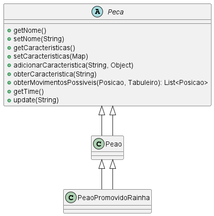

#### Motivação no contexto do tabuleiro -

Com a aplicação do Factory, a lógica de criação das peças é encapsulada em subclasses de `PecaFactory`, permitindo que novas peças sejam adicionadas sem modificar o código do Tabuleiro. O método *criarPeca* permite a criação de peças com características personalizadas.

```java
package main.java.br.com.frameworkPpr.boardgame.padroes.criacionais.factory;

import java.util.Map;

import main.java.br.com.frameworkPpr.boardgame.game.Peca;
import main.java.br.com.frameworkPpr.boardgame.padroes.comportamentais.strategy.MovimentoStrategy;
import main.java.br.com.frameworkPpr.boardgame.padroes.criacionais.multiton.Time;

public abstract class PecaFactory {
    public abstract Peca criarPeca(String tipo, Time time, MovimentoStrategy movimentoStrategy, Map<String, Object> caracteristicas);

    public Peca criarPecaGenerica(String nome, Time time, MovimentoStrategy movimentoStrategy, Map<String, Object> caracteristicas) {
        return new Peca(nome, time, movimentoStrategy, caracteristicas) {
            @Override
            public void update(String evento) {
                // Implementação padrão, pode ser sobrescrita
                throw new UnsupportedOperationException("Unimplemented method 'update'");
            }
        };
    }
}
```

Exemplo de uma subclasse concreta:

```java
public class AnimalFactory extends PecaFactory {
    @Override
    public Peca criarPeca(String tipo, Time time, MovimentoStrategy movimentoStrategy, Map<String, Object> caracteristicas) {
        return switch (tipo) {
            case "Elefante" -> new Elefante(tipo, time, movimentoStrategy, caracteristicas);
            case "Leão" -> new Leao(tipo, time, movimentoStrategy, caracteristicas);
            // outros tipos...
            default -> throw new IllegalArgumentException("Tipo de peça desconhecido: " + tipo);
        };
    }
}
```

Uso correto no Tabuleiro:

```java
public class Tabuleiro {
    private Peca[][] pecas;
    private PecaFactory pecaFactory;

    public Tabuleiro(PecaFactory pecaFactory) {
        this.pecaFactory = pecaFactory;
        pecas = new Peca[8][8];
        inicializarPecas();
    }

    private void inicializarPecas() {
        pecas[0][0] = pecaFactory.criarPeca("Rei", Time.getInstance("Branco"), new MovimentoRei(), null);
        pecas[0][1] = pecaFactory.criarPeca("Rainha", Time.getInstance("Branco"), new MovimentoRainha(), null);
        pecas[7][0] = pecaFactory.criarPeca("Rei", Time.getInstance("Preto"), new MovimentoRei(), null);
        pecas[7][1] = pecaFactory.criarPeca("Rainha", Time.getInstance("Preto"), new MovimentoRainha(), null);
    }
}
```

##### UML com Factory -

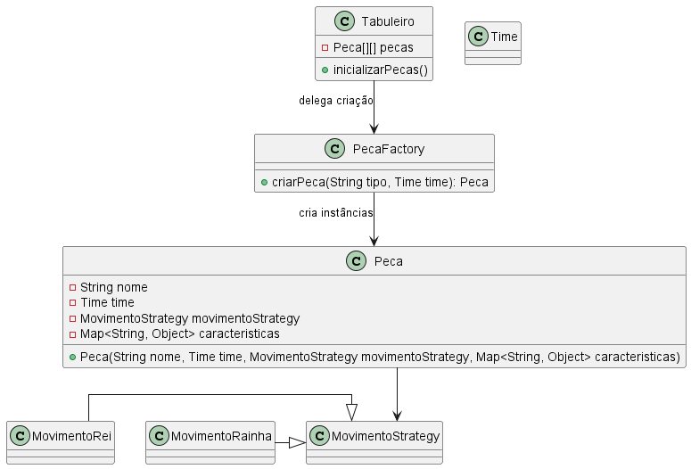


#### Participantes -

1. **Produto:** Peca -> define a interface base para os objetos que serão criados;
2. **Factory:** PecaFactory -> contém o método responsável por criar as instâncias das peças.
3. **ConcreteFactory:** AnimalFactory (ou outra) -> implementa a lógica de criação específica.
4. **Client:** Tabuleiro -> classe que utiliza a fábrica para criar objetos.

### Multiton (Não GOF)

#### Intenção -

[^K19]

Permitir a criação de uma quantidade limitada de instâncias de determinada classe e fornecer um modo para recuperá-las.

#### Motivação sem o Padrão -

Sem o multiton, o gerenciamento dos times teria que ser de forma manual com o uso de mapas para armazenar e recuperar as instâncias deles. Só que isso é menos eficiente uma vez que seria necessário acessar o mapa sempre que informações sobre um time fossem necessárias. Também não haveria garantia de unicidade para cada time podendo levar a inconsistências.

```java
// Exemplo sem Multiton
package main.java.br.com.frameworkPpr.xadrez.multiton.time;

import java.util.HashMap;
import java.util.Map;

public class GerenciadorTimes {
    private Map<String, Time> times;

    public GerenciadorTimes() {
        times = new HashMap<>();
        times.put("Branco", new Time("Branco"));
        times.put("Preto", new Time("Preto"));
    }

    public Time getTime(String nome) {
        return times.get(nome);
    }

    public void adicionarTime(String nome, Time time) {
        times.put(nome, time);
    }
}

class Time {
    private String nome;

    public Time(String nome) {
        this.nome = nome;
    }

    public String getNome() {
        return nome;
    }
}
```

``` java
GerenciadorTimes gerenciador = new GerenciadorTimes();
Time branco = gerenciador.getTime("Branco");
Time preto = gerenciador.getTime("Preto");
gerenciador.adicionarTime("Azul", new Time("Azul")); // Possível adicionar novos times manualmente
```

##### UML sem Multiton

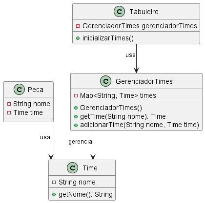>

#### Motivação no contexto do Tabuleiro -

No projeto, o padrão Multiton é aplicado por meio da classe `Time`, que mantém um mapa estático de instâncias únicas para cada nome de time. Assim, sempre que for necessário criar um time, é necessário chamar o método `getInstance` passando como parâmetro o nome do time. Caso esse time exista, o método vai retornar o mesmo. Caso não exista, o método cria o novo time. Isso garante unicidade e centralização do controle dos times, permitindo que cada time seja identificado de forma única e reutilizável em todo o sistema.

Exemplo simplificado da implementação real:

```java
package main.java.br.com.frameworkPpr.boardgame.padroes.criacionais.multiton;

import java.util.HashMap;
import java.util.Map;

public class Time {
    private static final Map<String, Time> times = new HashMap<>();
    private final String nome;

    private Time(String nome) {
        this.nome = nome;
    }

    public static Time getInstance(String nome) {
        return times.computeIfAbsent(nome, Time::new);
    }

    @Override
    public String toString() {
        return nome;
    }
}
```

Uso típico:

```java
Time branco = Time.getInstance("Branco");
Time preto = Time.getInstance("Preto");
Time azul = Time.getInstance("Azul"); // Garantido que "Azul" será único
```

##### UML com multiton -

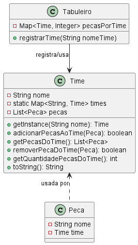>

Com o Multiton, declaramos instâncias únicas para representar os times, que podem ser usadas em diversas funcionalidades do sistema. O acesso é centralizado e consistente, evitando duplicidade e facilitando a manutenção.

#### Participantes -

1. **Multiton:** Classe `Time` -> mantém instâncias únicas para cada nome de time;
2. **Client:** (Tabuleiro), Peca -> classes que utilizam as instâncias do multiton.

### Singleton

#### Intenção -

Garantir que uma classe possua apenas uma instância e provê um ponto de acesso global a ela.

#### Motivação sem o Singleton -

Sem a aplicação do padrão, seria possível a criação de várias instâncias da sessão do jogo causando duplicidade e falta de controle já que haveria múltiplos jogos criados sem a centralização desses.

``` java
package main.java.br.com.frameworkPpr.boardgame.padroes.criacionais.singleton;

import main.java.br.com.frameworkPpr.boardgame.game.Jogador;
import main.java.br.com.frameworkPpr.boardgame.game.Tabuleiro;

/**
 * Classe GameSession SEM o padrão Singleton.
 * Permite múltiplas instâncias da sessão do jogo.
 */
public class GameSession {
    private Jogador jogador1;
    private Jogador jogador2;
    private Tabuleiro tabuleiro;

    /**
     * Construtor público, permitindo várias instâncias.
     * @param jogador1 Jogador 1
     * @param jogador2 Jogador 2
     * @param tabuleiro Tabuleiro do jogo
     */
    public GameSession(Jogador jogador1, Jogador jogador2, Tabuleiro tabuleiro) {
        this.jogador1 = jogador1;
        this.jogador2 = jogador2;
        this.tabuleiro = tabuleiro;
    }

    public Jogador getJogador1() {
        return jogador1;
    }

    public Jogador getJogador2() {
        return jogador2;
    }

    public Tabuleiro getTabuleiro() {
        return tabuleiro;
    }

    public void configurarTimes(String... nomesTimes) {
        for (String nomeTime : nomesTimes) {
            tabuleiro.registrarTime(nomeTime);
        }
    }
}
```

##### UML sem singleton

>


#### Motivação no contexto do GameSession -

Unicidade da sessão do jogo já que ele é um recurso central e único, varias instâncias dele causaria inconsistência no estado do jogo. Com o acesso global, outras partes do sistema, peças, jogadores, regras... podem interagir de forma consistente.

``` java
package main.java.br.com.frameworkPpr.boardgame.padroes.criacionais.singleton;

import main.java.br.com.frameworkPpr.boardgame.game.Jogador;
import main.java.br.com.frameworkPpr.boardgame.game.Tabuleiro;

/**
 * Classe Singleton responsável por gerenciar a sessão do jogo.
 * Garante que apenas uma instância de GameSession exista durante a execução.
 */
public class GameSession {
    // Jogador 1 da sessão
    private Jogador jogador1;
    // Jogador 2 da sessão
    private Jogador jogador2;
    // Tabuleiro associado à sessão
    private Tabuleiro tabuleiro;
    // Instância única da sessão (Singleton)
    private static GameSession instance;

    /**
     * Construtor privado para impedir instanciação externa.
     * @param jogador1 Jogador 1
     * @param jogador2 Jogador 2
     * @param tabuleiro Tabuleiro do jogo
     */
    private GameSession(Jogador jogador1, Jogador jogador2, Tabuleiro tabuleiro) {
        this.jogador1 = jogador1;
        this.jogador2 = jogador2;
        this.tabuleiro = tabuleiro;
    }

    /**
     * Obtém a instância única de GameSession, criando-a se necessário.
     * @param jogador1 Jogador 1
     * @param jogador2 Jogador 2
     * @param tabuleiro Tabuleiro do jogo
     * @return Instância única de GameSession
     */
    public static synchronized GameSession getInstance(Jogador jogador1, Jogador jogador2, Tabuleiro tabuleiro) {
        if (instance == null) {
            instance = new GameSession(jogador1, jogador2, tabuleiro);
        }
        return instance;
    }

    /**
     * Obtém a instância única de GameSession já criada.
     * @return Instância única de GameSession
     * @throws IllegalStateException se a sessão ainda não foi inicializada
     */
    public static synchronized GameSession getInstance() {
        if (instance == null) {
            throw new IllegalStateException("GameSession ainda não foi inicializada.");
        }
        return instance;
    }

    /**
     * Retorna o Jogador 1 da sessão.
     * @return Jogador 1
     */
    public Jogador getJogador1() {
        return jogador1;
    }

    /**
     * Retorna o Jogador 2 da sessão.
     * @return Jogador 2
     */
    public Jogador getJogador2() {
        return jogador2;
    }

    /**
     * Retorna o tabuleiro da sessão.
     * @return Tabuleiro
     */
    public Tabuleiro getTabuleiro() {
        return tabuleiro;
    }

    /**
     * Configura os times no tabuleiro a partir dos nomes fornecidos.
     * @param nomesTimes Lista de nomes dos times
     */
    public void configurarTimes(String... nomesTimes) {
        for (String nomeTime : nomesTimes) {
            tabuleiro.registrarTime(nomeTime);
        }
    }

    /**
     * Reseta a instância da sessão, permitindo nova inicialização.
     */
    public static synchronized void reset() {
        instance = null;
    }
}
```

##### UML com singleton

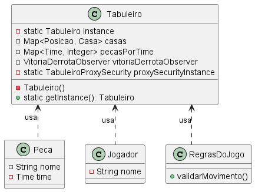

#### Participantes -

1. **Singleton:**
    Representado pela classe **GameSession** através de uma construtor privado, um método estático getInstance() que retorna a instância única dessa classe.
2. **Client:**
    Classes que utilizam a instância única da sessão do jogo para acessar ou modificar seu estado. Exemplos de clients incluem as classes que representam os **jogadores**, **regras do jogo** e qualquer outro componente que precise interagir com a sessão centralizada do jogo. Esses clients acessam a instância de `GameSession` por meio do método estático `getInstance()`.

## Padrões Estruturais

### Decorator

#### Intenção -

Permitir adicionar responsabilidades a um objeto de forma dinâmica, fornecendo uma alternativa flexível à subclasse para estender funcionalidades.

#### Motivação sem o padrão -

Sem o padrão Decorator, para adicionar novos comportamentos a uma peça (por exemplo, promover um peão), seria necessário criar subclasses específicas para cada combinação de comportamentos, aumentando a complexidade e dificultando a manutenção.

```java
// Exemplo sem Decorator
public class PeaoPromovidoRainha extends Peao {
    // Implementação duplicada ou alterada para representar a promoção
}
```

##### UML sem Decorator -


#### Motivação no contexto do tabuleiro

No projeto, o padrão Decorator é aplicado para permitir que peças recebam funcionalidades extras em tempo de execução, como a promoção de um peão. Isso é feito sem alterar a classe original da peça, apenas "envolvendo" a peça original com um decorador.

Exemplo de implementação real:

```java
// Decorator base
public abstract class PecaDecorator extends Peca {
    protected Peca pecaDecorada;

    public PecaDecorator(Peca pecaDecorada) {
        this.pecaDecorada = pecaDecorada;
    }

    @Override
    public String getNome() {
        return pecaDecorada.getNome();
    }
    // ...demais métodos delegados...
}

// Decorator concreto
public class PecaPromovidaDecorator extends PecaDecorator {
    public PecaPromovidaDecorator(Peca pecaDecorada) {
        super(pecaDecorada);
    }

    @Override
    public List<Posicao> obterMovimentosPossiveis(Posicao posicaoAtual, Tabuleiro tabuleiro) {
        // Lógica extra para peça promovida pode ser adicionada aqui
        return super.obterMovimentosPossiveis(posicaoAtual, tabuleiro);
    }
}
```

Uso típico:

```java
Peca peao = ...; // Peça original
Peca peaoPromovido = new PecaPromovidaDecorator(peao); // Adiciona comportamento de promoção
```

##### UML com Decorator

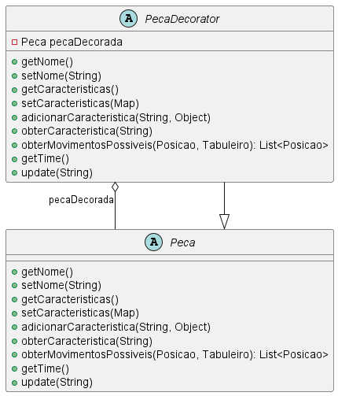


Com o Decorator, é possível estender funcionalidades das peças de forma flexível e dinâmica, sem criar uma explosão de subclasses.

#### Participantes

1. **Componente:** `Peca` — define a interface dos objetos que podem receber responsabilidades adicionais.
2. **Decorator:** `PecaDecorator` — implementa a interface de `Peca` e mantém uma referência para um objeto `Peca`.
3. **ConcreteDecorator:** `PecaPromovidaDecorator` — adiciona responsabilidades ao componente.
4. **Cliente:** Código que utiliza as peças decoradas.

### Proxy

#### Intenção -

atuar como intermediário entre o cliente e um objeto real, controlando o acesso a ele.

#### Motivação Sem o Padrão -

Sem o Proxy as classes *Peca* e *VitoriaDerrotaObserver* teriam que interagir diretamente com o objeto real *Tabuleiro*. Isso levaria a falta de controle de acesso já que não há uma camada intermediária para validar as ações antes executar. Operações inválidas poderiam ser realizadas no *Tabuleiro* e as lógicas de validações teriam de ser implementadas direto nessa classe.

``` java
package br.com.frameworkPpr.xadrez.board;

import br.com.frameworkPpr.xadrez.pieces.Peca;

public class Tabuleiro {
    private Peca[][] pecas;

    public Tabuleiro() {
        pecas = new Peca[8][8];
    }

    public void colocarPeca(Peca peca, int x, int y) {
        // Sem validações
        pecas[x][y] = peca;
    }

    public Peca obterPeca(int x, int y) {
        return pecas[x][y];
    }
}
```

##### UML sem Proxy -

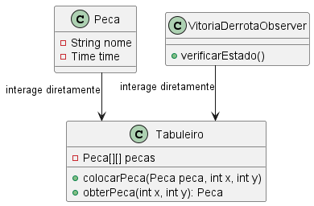>

#### Motivação no Contexto do tabuleiro -

No framework, o padrão Proxy é aplicado através da classe `TabuleiroProxySecurity`, que implementa a interface `TabuleiroInterface` e atua como camada intermediária entre o cliente e o objeto real `Tabuleiro`. O Proxy é responsável por realizar validações de estado do jogo (como se o jogo foi iniciado, se a posição é válida, se a casa está ocupada, etc.) antes de delegar as operações ao Tabuleiro real. Além disso, o Proxy é implementado como Singleton, garantindo uma única instância de controle de acesso ao tabuleiro.

Exemplo simplificado da implementação real:

```java
package main.java.br.com.frameworkPpr.boardgame.padroes.estruturais.proxy;

import java.util.Map;
import main.java.br.com.frameworkPpr.boardgame.game.Casa;
import main.java.br.com.frameworkPpr.boardgame.game.Peca;
import main.java.br.com.frameworkPpr.boardgame.game.Posicao;
import main.java.br.com.frameworkPpr.boardgame.game.TabuleiroInterface;
import main.java.br.com.frameworkPpr.boardgame.padroes.comportamentais.state.ContextoJogo;
import main.java.br.com.frameworkPpr.boardgame.padroes.comportamentais.state.EstadoIniciado;
import main.java.br.com.frameworkPpr.boardgame.padroes.comportamentais.state.EstadoJogo;

public class TabuleiroProxySecurity implements TabuleiroInterface {
    private int linhas;
    private int colunas;
    private static TabuleiroProxySecurity proxyInstance;
    private ContextoJogo contexto;

    private TabuleiroProxySecurity() {
        this.contexto = new ContextoJogo();
    }

    public static TabuleiroProxySecurity getInstance() {
        synchronized (TabuleiroProxySecurity.class) {
            if (proxyInstance == null) {
                proxyInstance = new TabuleiroProxySecurity();
            }
        }
        return proxyInstance;
    }

    private void verificarEstadoPermitido() {
        if (!(contexto.getEstadoAtual() instanceof EstadoIniciado)) {
            throw new IllegalStateException("Ação não permitida no estado atual do jogo: " + contexto.getEstadoAtual().getClass().getSimpleName());
        }
    }

    @Override
    public void inicializarCasas(int linhas, int colunas) {
        // validações...
    }

    @Override
    public void colocarPeca(Peca peca, Posicao posicao, Map<Posicao, Casa> casas) {
        verificarEstadoPermitido();
        // validações de posição e ocupação...
    }

    @Override
    public void moverPeca(Posicao origem, Posicao destino, Map<Posicao, Casa> casas) {
        verificarEstadoPermitido();
        // validações de origem/destino...
    }

    @Override
    public void removerPeca(Posicao posicao) {
        verificarEstadoPermitido();
        // validações...
    }

    // Métodos para iniciar, pausar, finalizar e reiniciar o jogo delegando ao ContextoJogo
    public void iniciarJogo() { contexto.iniciarJogo(); }
    public void pausarJogo() { contexto.pausarJogo(); }
    public void finalizarJogo() { contexto.finalizarJogo(); }
    public void reiniciarJogo() { contexto.reiniciarJogo(); }
}
```

No projeto, o `Tabuleiro` utiliza o Proxy para todas as operações sensíveis, garantindo que as regras de negócio e validações estejam centralizadas e desacopladas da lógica principal do tabuleiro.

##### UML com Proxy -

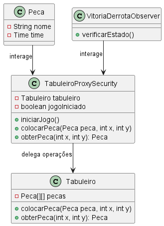>

#### Participantes -

1. **Proxy:** TabuleiroProxySecurity -> atua como intermediário entre o cliente e o objeto real, validando e controlando o acesso ao Tabuleiro. Implementa a interface TabuleiroInterface e é Singleton.
2. **Objeto real:** Tabuleiro -> contém a lógica principal do jogo, como gerenciar casas, peças e as interações. O *TabuleiroProxySecurity* delega as operações ao *Tabuleiro* após realizar as validações necessárias.
3. **Cliente:** Peca, VitoriaDerrotaObserver -> e demais classes que interagem com o tabuleiro por meio do proxy.

### Façade

#### Intenção

[^GAMA]

- Fornecer uma interface unificada para um conjunto de interfaces em um subsistema.
- O Façade define uma interface de nível mais alto que torna o subsistema mais fácil de ser usado.

#### Motivação

- Em um framework de tabuleiro, é necessário um ponto de entrada para acessar outras camadas e subsistemas, facilitando a implementação de regras de negócio.

##### Sem o Façade

- As classes que utilizam o tabuleiro precisariam interagir diretamente com suas dependências internas, como `Casa`, `Posicao` e `Peca`. Além disso, as regras de negócio seriam densas, misturando validação, registro, gerenciamento de vitória e demais implementações em si mesmas.
  
- Isso resultaria em:
  - Alto acoplamento entre as classes.
  - Maior complexidade para os consumidores do subsistema.
  - Classe `Tabuleiro` densa, o que dificultaria manutenções.
  - Perda da flexibilidade do tabuleiro.

###### UML sem Façade

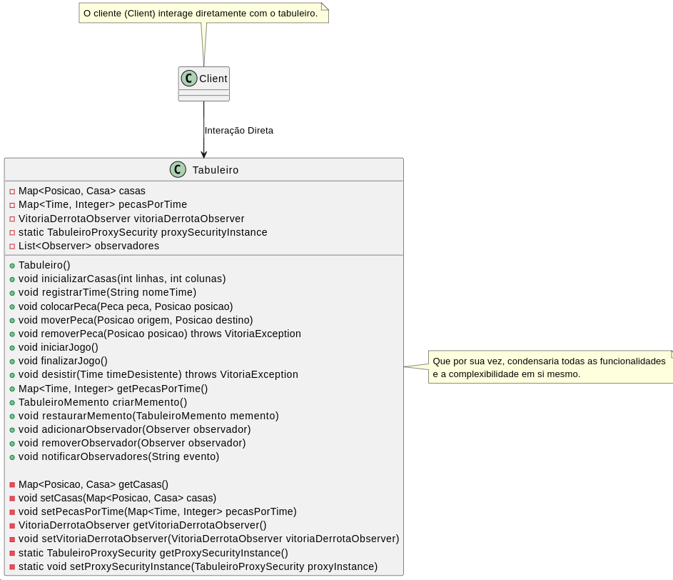

##### Com o Façade

- A classe `Tabuleiro` atua como o Façade, fornecendo uma interface simplificada que gerencia o estado do tabuleiro, as regras de negócio, o posicionamento de casas e demais subsistemas do mesmo.
- Nesse sentido, além de conter sua própria lógica, a classe delega responsabilidades específicas, como validações, para outras classes (ex.: `TabuleiroProxySecurity`, `Time`, `VitoriaDerrotaObserver`, `TabuleiroMemento`), escondendo a complexidade do subsistema. Isso explicita a aplicação do princípio da responsabilidade única, uma vez que o tabuleiro delega responsabilidades a cada subsistema.

- A classe `Tabuleiro` fornece métodos de alto nível, como:
  - `colocarPeca`: Adiciona uma peça ao tabuleiro em uma posição válida.
  - `moverPeca`: Move uma peça de uma posição para outra, verificando as regras de negócio.
  - `removerPeca`: Remove uma peça do tabuleiro, atualizando o estado.
- Esses métodos encapsulam a lógica interna e delegam as atribuições (explicitadas na seção de Participantes).
- Isso resulta em:
  - Redução do acoplamento entre as classes.
  - Uso simplificado do subsistema.
  - Maior flexibilidade.

###### UML com o Façade

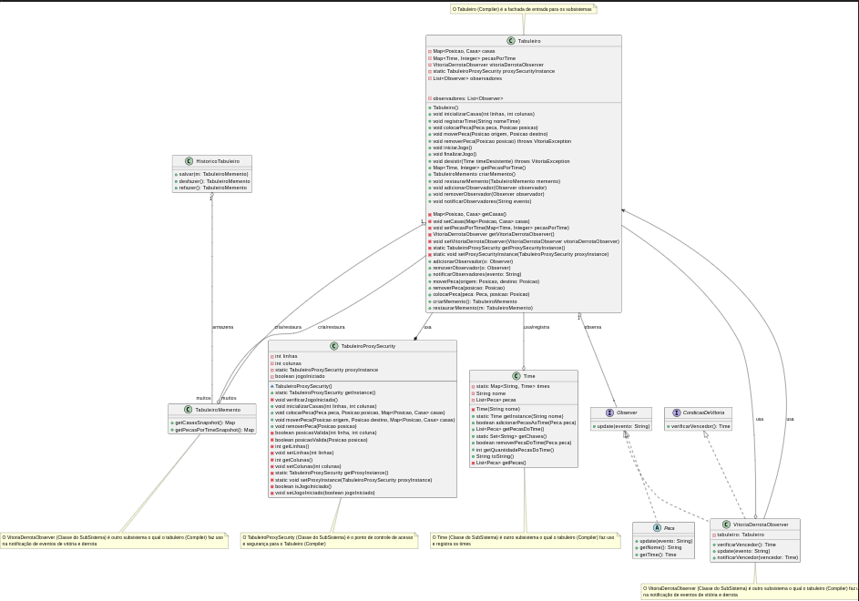

#### Participantes

- **Façade (`Tabuleiro`)**
  - Conhece quais classes do subsistema são responsáveis pelo atendimento de solicitações.
- **Classes de Subsistema** (`TabuleiroProxySecurity`, `Time`, `VitoriaDerrotaObserver`, `TabuleiroMemento`)
  - Implementam a funcionalidade do subsistema.
  - Encarregam-se do trabalho atribuído pelo Façade:
    - **`TabuleiroProxySecurity`:** Realiza validações de segurança e controle de acesso.
    - **`Time`:** Gerencia os times e suas peças.
    - **`VitoriaDerrotaObserver`:** Observa eventos para determinar condições de vitória ou derrota.
    - **`TabuleiroMemento`:** Permite salvar e restaurar o estado do tabuleiro.
  - Não têm conhecimento do Façade; isto é, não mantêm referências para ele.


### Flyweight

#### Intenção

O padrão Flyweight tem como objetivo compartilhar objetos para economizar memória, especialmente quando muitos objetos semelhantes são criados. Ele separa o estado compartilhado (intrínseco) do estado específico de cada instância (extrínseco).

#### Motivação sem o Flyweight

Sem o uso do Flyweight, cada casa, peça ou posição do tabuleiro seria representada por um novo objeto, mesmo que compartilhassem os mesmos atributos (ex: cor, tipo, posição). Isso resultaria em alto consumo de memória e redundância de dados.

##### UML sem Flyweight


#### Motivação no contexto do tabuleiro

No contexto do tabuleiro, existem muitas casas, peças e posições que podem ser reutilizadas. O padrão Flyweight permite que objetos com o mesmo estado sejam compartilhados, otimizando o uso de memória e melhorando a performance do sistema.

##### UML com Flyweight

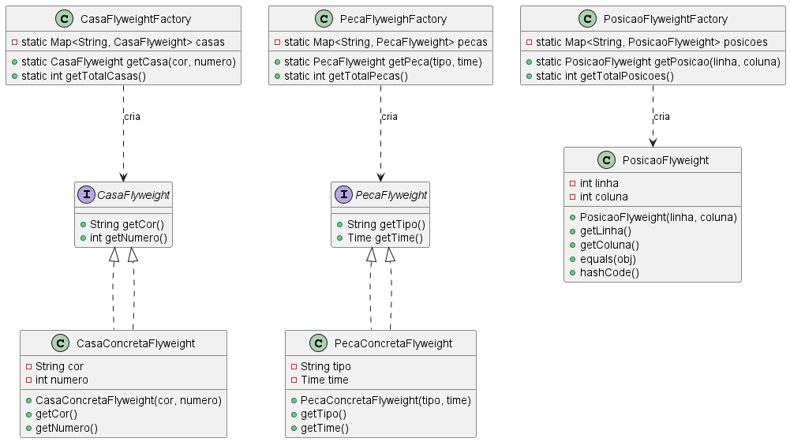


#### Participantes

- **Flyweight (CasaFlyweight, PecaFlyweight):** Interface para os objetos compartilhados.
- **ConcreteFlyweight (CasaConcretaFlyweight, PecaConcretaFlyweight, PosicaoFlyweight):** Implementação do Flyweight, armazena o estado intrínseco.
- **FlyweightFactory (CasaFlyweightFactory, PecaFlyweighFactory, PosicaoFlyweightFactory):** Garante o compartilhamento dos objetos.
- **Cliente:** Solicita objetos às fábricas e utiliza os Flyweights.

---

## Referências


[^GAMMA]: GAMMA, Erich. et al. Padrões de projetos: Soluções reutilizáveis de software orientados a objetos Bookman editora, 2009.

[^K19]: KASPCHUK, Alexandre; PLEIN, Tiago. K19 - Design Patterns em Java. São Paulo: K19 Treinamentos, 2012.