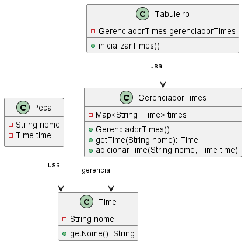
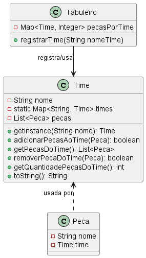

# Multiton (Não GOF)

### Intenção -

Permitir a criação de uma quantidade limitada de instâncias de determinada classe e fornecer um modo para recuperá-las.

### Motivação sem o Padrão -

Sem o multiton, o gerenciamento dos times teria que ser de forma manual com o uso de mapas para armazenar e recuperar as instâncias deles. Só que isso é menos eficiente uma vez que seria necessário acessar o mapa sempre que informações sobre um time fossem necessárias. Também não haveria garantia de unicidade para cada time podendo levar a inconsistências.

```java
// Exemplo sem Multiton
package main.java.br.com.frameworkPpr.xadrez.multiton.time;

import java.util.HashMap;
import java.util.Map;

public class GerenciadorTimes {
    private Map<String, Time> times;

    public GerenciadorTimes() {
        times = new HashMap<>();
        times.put("Branco", new Time("Branco"));
        times.put("Preto", new Time("Preto"));
    }

    public Time getTime(String nome) {
        return times.get(nome);
    }

    public void adicionarTime(String nome, Time time) {
        times.put(nome, time);
    }
}

class Time {
    private String nome;

    public Time(String nome) {
        this.nome = nome;
    }

    public String getNome() {
        return nome;
    }
}
```

``` java
GerenciadorTimes gerenciador = new GerenciadorTimes();
Time branco = gerenciador.getTime("Branco");
Time preto = gerenciador.getTime("Preto");
gerenciador.adicionarTime("Azul", new Time("Azul")); // Possível adicionar novos times manualmente
```

#### UML sem Multiton

>

### Motivação no contexto do Tabuleiro -

No projeto, o padrão Multiton é aplicado por meio da classe `Time`, que mantém um mapa estático de instâncias únicas para cada nome de time. Assim, sempre que for necessário criar um time, é necessário chamar o método `getInstance` passando como parâmetro o nome do time. Caso esse time exista, o método vai retornar o mesmo. Caso não exista, o método cria o novo time. Isso garante unicidade e centralização do controle dos times, permitindo que cada time seja identificado de forma única e reutilizável em todo o sistema.

Exemplo simplificado da implementação real:

```java
package main.java.br.com.frameworkPpr.boardgame.padroes.criacionais.multiton;

import java.util.HashMap;
import java.util.Map;

public class Time {
    private static final Map<String, Time> times = new HashMap<>();
    private final String nome;

    private Time(String nome) {
        this.nome = nome;
    }

    public static Time getInstance(String nome) {
        return times.computeIfAbsent(nome, Time::new);
    }

    @Override
    public String toString() {
        return nome;
    }
}
```

Uso típico:

```java
Time branco = Time.getInstance("Branco");
Time preto = Time.getInstance("Preto");
Time azul = Time.getInstance("Azul"); // Garantido que "Azul" será único
```

#### UML com multiton -

>

Com o Multiton, declaramos instâncias únicas para representar os times, que podem ser usadas em diversas funcionalidades do sistema. O acesso é centralizado e consistente, evitando duplicidade e facilitando a manutenção.

### Participantes -

1. **Multiton:** Classe `Time` -> mantém instâncias únicas para cada nome de time;
2. **Client:** (Tabuleiro), Peca -> classes que utilizam as instâncias do multiton.
