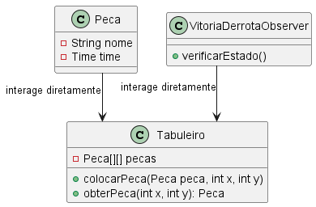
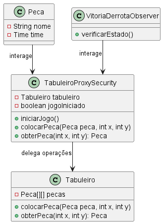

# Proxy

### Intenção -

atuar como intermediário entre o cliente e um objeto real, controlando o acesso a ele.

### Motivação Sem o Padrão -

Sem o Proxy as classes *Peca* e *VitoriaDerrotaObserver* teriam que interagir diretamente com o objeto real *Tabuleiro*. Isso levaria a falta de controle de acesso já que não há uma camada intermediária para validar as ações antes executar. Operações inválidas poderiam ser realizadas no *Tabuleiro* e as lógicas de validações teriam de ser implementadas direto nessa classe.

``` java
package br.com.frameworkPpr.xadrez.board;

import br.com.frameworkPpr.xadrez.pieces.Peca;

public class Tabuleiro {
    private Peca[][] pecas;

    public Tabuleiro() {
        pecas = new Peca[8][8];
    }

    public void colocarPeca(Peca peca, int x, int y) {
        // Sem validações
        pecas[x][y] = peca;
    }

    public Peca obterPeca(int x, int y) {
        return pecas[x][y];
    }
}
```

### UML sem Proxy -

>

### Motivação no Contexto do tabuleiro -

No framework, o padrão Proxy é aplicado através da classe `TabuleiroProxySecurity`, que implementa a interface `TabuleiroInterface` e atua como camada intermediária entre o cliente e o objeto real `Tabuleiro`. O Proxy é responsável por realizar validações de estado do jogo (como se o jogo foi iniciado, se a posição é válida, se a casa está ocupada, etc.) antes de delegar as operações ao Tabuleiro real. Além disso, o Proxy é implementado como Singleton, garantindo uma única instância de controle de acesso ao tabuleiro.

Exemplo simplificado da implementação real:

```java
package main.java.br.com.frameworkPpr.boardgame.padroes.estruturais.proxy;

import java.util.Map;
import main.java.br.com.frameworkPpr.boardgame.game.Casa;
import main.java.br.com.frameworkPpr.boardgame.game.Peca;
import main.java.br.com.frameworkPpr.boardgame.game.Posicao;
import main.java.br.com.frameworkPpr.boardgame.game.TabuleiroInterface;
import main.java.br.com.frameworkPpr.boardgame.padroes.comportamentais.state.ContextoJogo;
import main.java.br.com.frameworkPpr.boardgame.padroes.comportamentais.state.EstadoIniciado;
import main.java.br.com.frameworkPpr.boardgame.padroes.comportamentais.state.EstadoJogo;

public class TabuleiroProxySecurity implements TabuleiroInterface {
    private int linhas;
    private int colunas;
    private static TabuleiroProxySecurity proxyInstance;
    private ContextoJogo contexto;

    private TabuleiroProxySecurity() {
        this.contexto = new ContextoJogo();
    }

    public static TabuleiroProxySecurity getInstance() {
        synchronized (TabuleiroProxySecurity.class) {
            if (proxyInstance == null) {
                proxyInstance = new TabuleiroProxySecurity();
            }
        }
        return proxyInstance;
    }

    private void verificarEstadoPermitido() {
        if (!(contexto.getEstadoAtual() instanceof EstadoIniciado)) {
            throw new IllegalStateException("Ação não permitida no estado atual do jogo: " + contexto.getEstadoAtual().getClass().getSimpleName());
        }
    }

    @Override
    public void inicializarCasas(int linhas, int colunas) {
        // validações...
    }

    @Override
    public void colocarPeca(Peca peca, Posicao posicao, Map<Posicao, Casa> casas) {
        verificarEstadoPermitido();
        // validações de posição e ocupação...
    }

    @Override
    public void moverPeca(Posicao origem, Posicao destino, Map<Posicao, Casa> casas) {
        verificarEstadoPermitido();
        // validações de origem/destino...
    }

    @Override
    public void removerPeca(Posicao posicao) {
        verificarEstadoPermitido();
        // validações...
    }

    // Métodos para iniciar, pausar, finalizar e reiniciar o jogo delegando ao ContextoJogo
    public void iniciarJogo() { contexto.iniciarJogo(); }
    public void pausarJogo() { contexto.pausarJogo(); }
    public void finalizarJogo() { contexto.finalizarJogo(); }
    public void reiniciarJogo() { contexto.reiniciarJogo(); }
}
```

No projeto, o `Tabuleiro` utiliza o Proxy para todas as operações sensíveis, garantindo que as regras de negócio e validações estejam centralizadas e desacopladas da lógica principal do tabuleiro.

### UML com Proxy -

>

### Participantes -

1. **Proxy:** TabuleiroProxySecurity -> atua como intermediário entre o cliente e o objeto real, validando e controlando o acesso ao Tabuleiro. Implementa a interface TabuleiroInterface e é Singleton.
2. **Objeto real:** Tabuleiro -> contém a lógica principal do jogo, como gerenciar casas, peças e as interações. O *TabuleiroProxySecurity* delega as operações ao *Tabuleiro* após realizar as validações necessárias.
3. **Cliente:** Peca, VitoriaDerrotaObserver -> e demais classes que interagem com o tabuleiro por meio do proxy.
