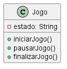

# State

### Intenção

Permitir que um objeto altere seu comportamento quando seu estado interno muda. Ele encapsula os possíveis estados de um objeto em *classes separadas* promovendo a separação de responsabilidades.

### Motivação sem o padrão

Sem a aplicação do pasrão o comportamento do objeto setia controlado por grandes estruturas de if-else ou switch-case que verificariam o estado atual pra decidir o que fazer. Toda lógica de estados estaria concentrada em apenas uma classe dificultando

### Exemplo de código sem o padrão State

```java
// Exemplo sem o padrão State
public class Jogo {
    private String estado = "INICIADO";

    public void iniciarJogo() {
        if ("INICIADO".equals(estado)) {
            System.out.println("O jogo já está iniciado.");
        } else if ("PAUSADO".equals(estado)) {
            estado = "INICIADO";
            System.out.println("Jogo retomado.");
        } else if ("FINALIZADO".equals(estado)) {
            System.out.println("Não é possível iniciar, o jogo já foi finalizado.");
        }
    }

    public void pausarJogo() {
        if ("INICIADO".equals(estado)) {
            estado = "PAUSADO";
            System.out.println("Jogo pausado.");
        } else {
            System.out.println("Não é possível pausar neste estado: " + estado);
        }
    }

    public void finalizarJogo() {
        if (!"FINALIZADO".equals(estado)) {
            estado = "FINALIZADO";
            System.out.println("Jogo finalizado.");
        } else {
            System.out.println("O jogo já está finalizado.");
        }
    }
}
```

### UML sem o padrão




### Motivação com o Padrão

O padrão State é utilizado no projeto para controlar o comportamento do jogo conforme o seu estado atual (iniciado, pausado, finalizado, etc.), evitando o uso de grandes estruturas condicionais e promovendo a separação de responsabilidades.

### Implementação no framework

Objeto principal que representa o contexto do jogo é a classe ContextoJogo

```java
package main.java.br.com.frameworkPpr.boardgame.padroes.comportamentais.State;

public class ContextoJogo {
    private EstadoJogo estadoAtual;

    public ContextoJogo() {
        this.estadoAtual = new EstadoIniciado(this);
    }

    public void setEstadoAtual(EstadoJogo novoEstado)
    {
        this.estadoAtual = novoEstado;
    }

    public void iniciarJogo() {
        estadoAtual.iniciarJogo();
    }

    public void pausarJogo() {
        estadoAtual.pausarJogo();
    }

    public void reiniciarJogo(){
        estadoAtual.reiniciarJogo();
    }

    public void finalizarJogo() {
        estadoAtual.finalizarJogo();
    }

    public EstadoJogo getEstadoAtual() {
        return estadoAtual;
    }
}

```

O estado atual do jogo é representado pela interface EstadoJogo e suas implementações concretas EstadoIniciado, EstadoPausado e EstadoFinalizado.

```java
package main.java.br.com.frameworkPpr.boardgame.padroes.comportamentais.State;

import main.java.br.com.frameworkPpr.boardgame.game.Tabuleiro;

public interface EstadoJogo {
    void iniciarJogo();
    void pausarJogo();
    void finalizarJogo();
    void reiniciarJogo();
}

```

### UML com o padrão


### Participantes

1. **State:** EstadoJogo -> Interface que define as operações para os diferentes estados do jogo.
2. **ConcreteState:** Estados concretos -> Implementações concretas da interface EstadoJogo, cada uma representando um estado do jogo.
3. **Context:** ContextoJogo -> Classe que mantém uma referência para o estado atual e delega as operações para o estado corrente.
4. **Client:** Tabuleiro/TabuleiroProxySecurity -> Classes que utilizam o ContextoJogo para controlar o fluxo do jogo, delegando as operações de estado.
