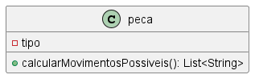
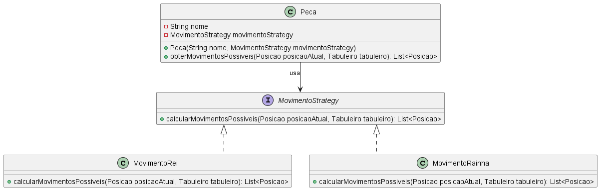

# Strategy

### Intenção -

Definir uma família de algoritmos em classes separadas para que seus objetos sejam intercambiáveis.

### Motivação sem o Padrão -

Sem o uso do Strategy a implementação de movimento de peças teria que ser diretamente na classe *Peça*. Isso reduz a flexibilidade já que toda lógica de movimento de diferentes peças estaria centralizada em uma única classe, assim, não seria possível reutiliar a lógica em outro contexto sem a duplicação do código. Para adicionar novas peças ou até mesmo alterar a lógica do movimento, teriamos que modificar a classe *Peça* violando o princípio **Open/Closed** - aberto para extensão e fechado para modificação.

``` java
package br.com.frameworkPpr.xadrez.pecas;

import java.util.ArrayList;
import java.util.List;

public class Peca {
    private String tipo;

    public Peca(String tipo) {
        this.tipo = tipo;
    }

    public List<String> calcularMovimentosPossiveis() {
        List<String> movimentos = new ArrayList<>();

        switch (tipo) {
            case "Rei":
                // Lógica de movimento do Rei
                movimentos.add("Movimento do Rei");
                break;
            case "Rainha":
                movimentos.add("Movimento da Rainha");
                break;
            case "Bispo":
                movimentos.add("Movimento do Bispo");
                break;
            default:
                throw new IllegalArgumentException("Tipo de peça desconhecido: " + tipo);
        }
        return movimentos;
    }
}
```

### UML sem o Strategy -




### Motivação no contexto do Tabuleiro

Aqui, o strategy é usado para definir diferentes estratégias de movimento para as peças. Cada peça pode ter sua própria lógica de movimento. A interface *MovimentoStrategy* define o método *calcularMovimentosPossiveis* que é implementado por classes específicas para cada tipo de peça.

``` java
package main.java.br.com.frameworkPpr.boardgame.padroes.comportamentais.strategy;

import java.util.List;

import main.java.br.com.frameworkPpr.boardgame.game.Posicao;
import main.java.br.com.frameworkPpr.boardgame.game.Tabuleiro;

public interface MovimentoStrategy {
    List<Posicao> calcularMovimentosPossiveis(Posicao posicaoAtual, Tabuleiro tabuleiro);
}
```

exemplo de aplicação para uma peça:

``` java
package main.java.br.com.frameworkPpr.xadrez.movement;

import main.java.br.com.frameworkPpr.xadrez.board.Posicao;
import main.java.br.com.frameworkPpr.xadrez.board.tabuleiro.singletonEProxySecurity.Tabuleiro;
import java.util.ArrayList;
import java.util.List;

public class MovimentoRei implements MovimentoStrategy {
    @Override
    public List<Posicao> calcularMovimentosPossiveis(Posicao posicaoAtual, Tabuleiro tabuleiro) {
        List<Posicao> movimentos = new ArrayList<>();
        return movimentos;
    }
}
```

### UML com Strategy -



### Participantes -

1. **Strategy:** MovimentoStrategy -> declara o método calcularMovimentosPossiveis que é implementado por diferentes estratégias;
2. **ConcretStrategy:** serão os métodos que implementam a interace MovimentoStrategy que criarão a lógica específica de cada peça;
3. **Context:** Peca -> contém a referência para um objeto MovimentoStrategy, delega a execução do método *calcularMovimentosPossiveis* para a estratégia associada (ConcretStrategy).
